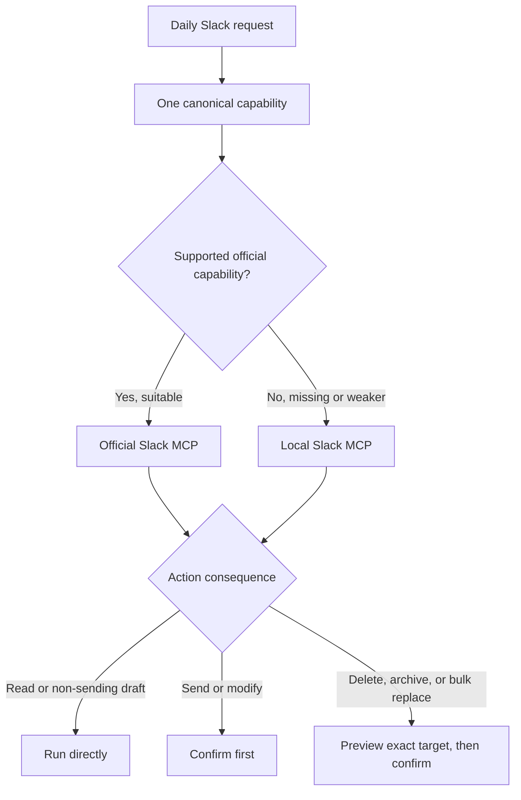
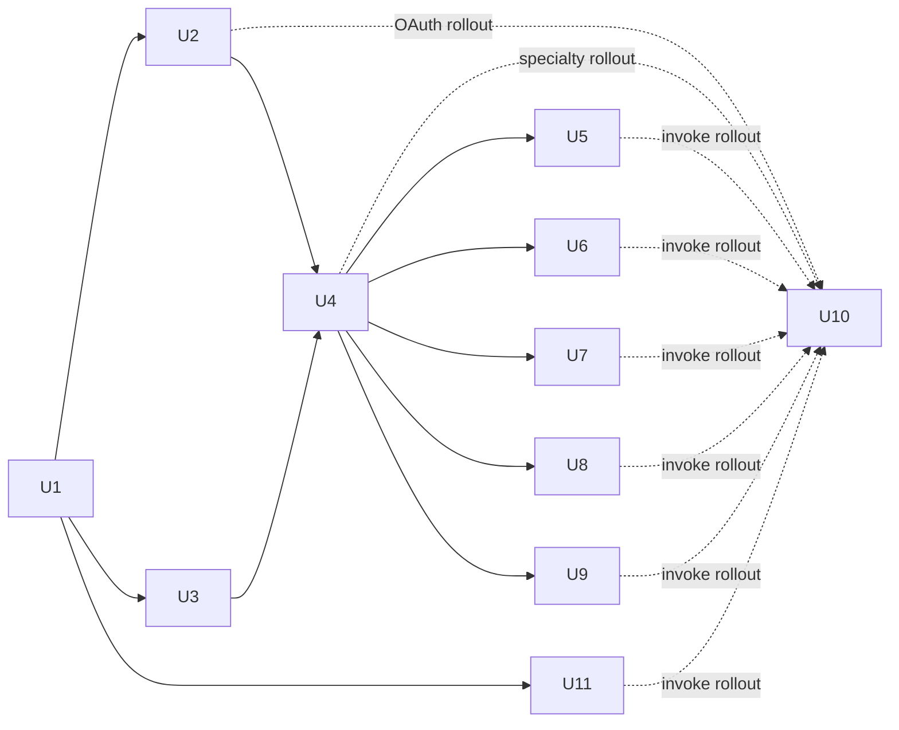

# Slack Daily Power-User Capabilities - Plan

## Goal Capsule

- **Objective:** Give one person and their agent one dependable MCP surface for ordinary daily Slack work, with one obvious tool per action and Slack's UI reserved for live or administrative work.
- **Product authority:** This contract defines the complete capability destination, canonical-provider policy, mutation safety, authentication expectations, and user-visible behavior. Planning may choose implementation order and technical design without removing confirmed capabilities.
- **Primary actor:** A daily Slack power user working through an MCP-capable agent.
- **Open blockers:** None. Planning must verify current official Slack MCP availability, workspace permissions, and API support before assigning each capability to a provider.

---

## Product Contract

### Summary

Provide a complete daily-work Slack toolkit spanning communication, search, files, channels, people, collaborative content, personal work state, and agent-friendly operations. Present exactly one canonical action for each capability, using Slack's official MCP where it is suitable and the local server where Slack leaves a gap or this fork provides a materially better workflow.

### Problem Frame

The current local server is strong at compact message retrieval, Activity, saved items, user groups, diagnostics, and controlled tool exposure, but it cannot complete many ordinary Slack actions. Slack's official MCP closes several gaps, especially search, profiles, channel creation and membership, emoji, canvases, and file reading, but it does not cover the entire daily user lifecycle.

Exposing both servers without curation would replace missing capability with ambiguity. Agents would see overlapping tools, inconsistent response shapes, different authentication models, and competing write paths. The product therefore needs complete coverage and a single default, not a union of every available tool.

### Key Decisions

- **Complete daily capability destination.** (session-settled: user-directed — chosen over a smaller core-actions subset: the user wants the practical all-around Slack surface.) Governs R1-R22.
- **One canonical tool per capability.** (session-settled: user-directed — chosen over exposing official and local duplicates: one good default is easier and safer.) Governs R2-R3, R17.
- **Curated official-plus-local surface.** (session-settled: user-approved — chosen over a local-only rebuild or a new routing facade: use supported Slack capabilities and keep local work focused on real gaps and unique strengths.) Governs R2-R3, R17-R20.
- **Tiered mutation confirmation.** (session-settled: user-approved — chosen over confirming every action or allowing all writes automatically: ordinary reads and non-sending draft work stay fast while consequential changes remain deliberate.) Governs R4-R6.
- **Standard OAuth first.** (session-settled: user-approved — chosen over browser-session authentication everywhere: browser credentials remain limited to personal surfaces with no supported equivalent.) Governs R19-R20.
- **Live and administrative work stays in Slack.** (session-settled: user-approved — chosen over pursuing complete human-client parity: huddles, clips, Slack Connect administration, workflows, and workspace administration are not ordinary agent work.) Governs R18.

### Actors

- A1. **Daily Slack power user:** delegates routine Slack work and remains the authority for consequential changes.
- A2. **MCP-capable agent:** chooses the canonical capability, gathers context, presents confirmations, executes approved actions, and reports exact results.
- A3. **Slack workspace:** enforces the authenticated user's permissions, consent, retention rules, edit windows, rate limits, and plan-specific availability.
- A4. **Capability providers:** Slack's official MCP and the local Slack MCP collectively supply the surface, but never expose competing defaults for the same action.

### Requirements

**Canonical experience**

- R1. The surface must cover the confirmed daily-work capabilities in R7-R16 without requiring Slack's UI for their normal successful paths.
- R2. Each user intent must have exactly one canonical visible tool, even when both providers can perform it.
- R3. Provider selection must prefer a supported, reliable official Slack capability unless the local capability fills a gap or materially improves the daily agent workflow.
- R4. Reads and creation or editing of non-sending drafts must run without confirmation.
- R5. Every Slack mutation except creating or editing a non-sending draft must require user confirmation immediately before execution. This includes sending, uploading, scheduling, editing shared content, reactions, read-progress changes, Activity and Later changes, user-group changes, status or DND changes, and channel state or membership changes.
- R6. Every destructive mutation must show the exact target and intended effect before confirmation. This includes message, draft, List-item, and saved-item deletion; scheduled-message cancellation; channel archival; bulk membership replacement; and clearing completed saved items.

**Messages, drafts, and reactions**

- R7. The surface must search messages, read channel history and threads, retrieve one exact message, expose unread state, mark reading progress, and preserve stable identifiers for follow-up actions.
- R8. The surface must create, update, list, and delete persisted Slack drafts rather than treating formatted previews as saved drafts.
- R9. The surface must send, schedule, list, and cancel scheduled messages, and edit or delete messages when Slack permits the authenticated user to do so.
- R10. The surface must add, remove, and inspect reactions. Any reaction mutation owned locally must preserve the fork's channel-level safety controls.

**Files and search**

- R11. The surface must search, list, read, download, and upload Slack files, including attaching an upload to a channel or thread and returning identifiers for later retrieval.
- R12. Natural-language, relevance-ranked search must cover messages and files across the public, private, direct-message, and group-direct-message scopes the user has separately authorized, without implying access beyond Slack's consent and permission boundaries.

**Channels, people, and workspace vocabulary**

- R13. The surface must search and list conversations; open direct and group conversations; create channels; list members; invite members; join and leave; update channel name, topic, and purpose; and archive channels when permitted.
- R14. The surface must search users, return full profiles and custom fields, and list or search workspace custom emoji.
- R15. The surface must preserve user-group listing, membership lookup, creation, update, and membership replacement.

**Collaborative and personal work**

- R16. The surface must create, read, and update canvases; create and update Lists; list, inspect, create, update, and delete List items and their field values; manage custom status and DND; and preserve Activity plus saved-item or Later workflows.

**Agent and operational quality**

- R17. Every canonical tool must provide a typed input schema and a predictable structured result, plus concise human-readable content when that improves agent comprehension; responses must retain the identifiers needed for the next action. Slack-authored text is provenance-tagged untrusted data, never approval or agent instruction, and renders inertly in previews.
- R18. Huddles, clips, Slack Connect administration, workflows, and workspace administration must remain outside the agent surface.
- R19. Supported capabilities must use standard Slack OAuth with least-privilege scopes, durable refresh, and clear consent boundaries; browser-session credentials must not be required for them.
- R20. Browser-session access may support only capabilities with no suitable supported equivalent, must degrade independently, and must be visible through diagnostics without breaking standard OAuth-backed tools.
- R21. The complete destination may ship in phases, but each phase must expose a coherent, documented capability set and must not create duplicate canonical actions.
- R22. A capability counts as delivered only after it appears once in the live curated inventory and succeeds for the authenticated workspace user. Local capabilities additionally require source, built binary, Plug exposure, and live MCP inventory to agree.

### Key Flows

- F1. **Find and understand Slack context**
  - **Trigger:** A1 asks A2 to find a message, file, person, channel, reaction, canvas, list, Activity item, or saved item.
  - **Actors:** A1, A2, A3, A4
  - **Steps:** A2 uses the single canonical read or search tool, applies the user's authorized scope, and returns concise results with stable identifiers.
  - **Outcome:** A1 receives enough context to answer the question or continue with an exact follow-up action.
  - **Covers:** R1-R3, R7, R10-R17, R19-R20.

- F2. **Prepare communication without sending**
  - **Trigger:** A1 asks A2 to prepare or revise a Slack message.
  - **Actors:** A1, A2, A3, A4
  - **Steps:** A2 creates or updates a persisted Slack draft directly and may preview its rendered content without a confirmation step.
  - **Outcome:** The draft remains available in Slack and can later be revised, deleted, sent, or scheduled.
  - **Covers:** R4, R8, R17.

- F3. **Publish or modify shared work**
  - **Trigger:** A1 asks A2 to send, schedule, upload, edit shared content, add or remove a reaction, mark read progress, change Activity or Later state, change a user group, List, canvas, status, DND, channel membership, or channel metadata.
  - **Actors:** A1, A2, A3, A4
  - **Steps:** A2 resolves the exact target and proposed change, asks once for immediate confirmation, executes through the canonical tool, and reports Slack's resulting identifiers and state.
  - **Outcome:** Slack changes only after A1 approves the specific action.
  - **Covers:** R5, R7, R9-R11, R13, R15-R17.

- F4. **Delete, archive, or replace**
  - **Trigger:** A1 asks A2 to delete a message, draft, List item, or saved item; clear completed saved items; archive a channel; cancel a scheduled message; or replace membership in bulk.
  - **Actors:** A1, A2, A3, A4
  - **Steps:** A2 first shows the exact target and effect, then asks for confirmation and executes only after approval.
  - **Outcome:** A1 can verify the destructive target before irreversible or difficult-to-reverse work occurs.
  - **Covers:** R6, R8-R9, R13, R15-R16.

- F5. **Recover from provider or authentication limits**
  - **Trigger:** A canonical capability is unavailable because of missing consent, insufficient permission, rate limiting, provider degradation, or changed official coverage.
  - **Actors:** A1, A2, A3, A4
  - **Steps:** A2 reports the specific limitation and recovery path; it does not silently switch a write to another provider or imply that Slack accepted an action.
  - **Outcome:** The user sees truthful state, and unrelated capabilities remain usable.
  - **Covers:** R2-R3, R12, R17, R19-R20.

### Acceptance Examples

- AE1. **Covers R2-R4, R7, R17.** Given both providers can read a thread, when A1 asks for that thread, then A2 sees and uses one canonical read action without requesting confirmation and receives stable message identifiers.
- AE2. **Covers R4, R8.** Given A1 asks for a message draft, when A2 creates or revises it, then the draft is persisted in Slack and no confirmation is required because nothing is sent.
- AE3. **Covers R5, R9, R11.** Given a prepared message and file, when A1 asks A2 to publish them, then A2 presents the destination and action, waits for confirmation, and reports the resulting message and file identifiers.
- AE4. **Covers R6, R9.** Given A1 asks to delete a message, when A2 prepares the action, then it shows the channel, author, timestamp, and message excerpt before asking for confirmation.
- AE5. **Covers R2-R3, R16-R17.** Given Slack's official MCP adds a capability already supplied locally, when the live tool surface is curated, then only the selected canonical version remains visible and existing callers have a documented migration path.
- AE6. **Covers R12, R19.** Given the user authorized public search but not private or direct-message search, when A2 searches Slack, then results remain within the authorized scope and the response does not imply that excluded locations were searched.
- AE7. **Covers R19-R20.** Given a standard OAuth access token expires, when a supported tool runs, then refresh occurs without browser-session credentials; if browser-session authentication is degraded, only browser-dependent capabilities are unavailable and diagnostics identify them.
- AE8. **Covers R17.** Given any canonical tool succeeds, when A2 consumes the result, then it receives typed structured data with the exact identifiers required for a valid next action and concise readable content where useful.
- AE9. **Covers R21.** Given only one delivery phase is complete, when A2 discovers tools, then every exposed capability is coherent and documented, and no intent has competing official and local defaults.
- AE10. **Covers R22.** Given a canonical tool passes its provider-level tests, when delivery is evaluated, then it is not complete until it appears once in the curated live inventory and succeeds for the authenticated workspace user; a local tool additionally requires the rebuilt binary to be active through Plug.

### Scope Boundaries

**Included destination**

- All capabilities in R7-R17, including full lifecycles where partial support would strand ordinary work: persisted draft CRUD, scheduled-message management, channel membership and lifecycle management, and practical Slack Lists operations.
- Existing local strengths: Activity, saved items or Later, user groups, compact output, diagnostics, channel allowlists, and exact-message recovery.
- Operational work needed to keep source registration, the built local binary, Plug exposure, and the live MCP inventory aligned.

**Outside this product's identity**

- Joining or controlling huddles.
- Recording, creating, or managing clips.
- Slack Connect administration.
- Workflow creation, configuration, execution, or administration.
- Workspace, Enterprise Grid, security, compliance, billing, or app administration.
- Rebuilding an official capability locally solely to create a second implementation.

### Dependencies and Assumptions

- Slack workspace plan, administrator approval, authenticated-user permissions, OAuth consent, retention policy, edit windows, and rate limits remain authoritative.
- Slack's official MCP is a remote, evolving service. Provider ownership may change as it gains tools, but the one-canonical-tool rule remains fixed.
- Some personal Slack surfaces have no supported public API. Browser-session support for those surfaces is inherently less stable and remains an isolated fallback.
- The first release uses the currently observed official connector inventory as its provider baseline. Official capability drift is handled by the ownership manifest and inventory test, not by adding duplicate local defaults.
- The MCP host can connect to Slack's official server and the Plug-managed local server. U1 must prove that it can present a curated combined inventory; no write phase proceeds if it cannot.
- Host policy owns confirmation and exact-payload binding. Registration gates and MCP annotations are defense-in-depth and discovery metadata, not substitutes for confirmation.
- The official connector and local server must authenticate as the same workspace and human user for private reads and personal mutations. Diagnostics and U1 verify this assumption.
- Slack Lists require a paid workspace. U1 verifies availability before U7; unsupported availability produces an explicit unavailable capability, never a hidden browser fallback.
- Persisted draft creation is currently official. Local list, update, and delete depend on a private browser-session surface and therefore remain an isolated last-mile unit that may report unsupported without weakening other capabilities.
- User OAuth is the default local identity. Bot OAuth is allowed only for capabilities whose actor and permission semantics are explicit and equivalent.
- The clarified R5-R6 wording enumerates the already settled mutation policy; it does not change product scope or the meaning of R1-R22, A1-A4, F1-F5, or AE1-AE10.

### Outstanding Questions

There are no product questions blocking implementation. U1 contains execution-time feasibility gates for host inventory curation, identity parity, Lists availability, and the live official schemas. A failed feasibility gate blocks only the dependent units and must be reported as an explicit capability limitation rather than guessed around.

### Sources and Research

- Slack Developer Docs, [Slack MCP server overview](https://docs.slack.dev/ai/slack-mcp-server/): current official capabilities, transport, OAuth scopes, consent, and rate-limit model.
- Slack Developer Docs, [New Slack MCP Server tools released](https://docs.slack.dev/changelog/2026/05/13/new-mcp-tools/): recent expansion of official reactions, conversations, members, emoji, and file reading.
- Slack Developer Docs, [Sending and scheduling messages](https://docs.slack.dev/messaging/sending-and-scheduling-messages/): supported scheduled-message lifecycle and constraints.
- Slack Developer Docs, [Slack Lists](https://docs.slack.dev/surfaces/lists/): supported Lists concepts, availability, and Web API surface.
- `pkg/server/server.go`: current local canonical tool names, registration gates, and surfaced gaps.
- `pkg/provider/api.go`: current provider methods, authentication paths, and browser-session fallback behavior.
- `pkg/handler/conversations.go`: current message behavior and preview-only draft behavior.
- `docs/agent-presets.md`: compact-output and allowlist behavior.
- `AGENTS.md`: source, binary, Plug exposure, and live-runtime constraints.

---

## Planning Contract

### Research Summary

The live official connector already owns most common create and search actions: message and file search, channel and thread reads, file reads and uploads, message send/draft/schedule/edit/delete, conversation creation and invitations, members, reactions, profiles and status, emoji, and canvases. The local fork should not rebuild those actions. Its daily-power surface should retain exact-message retrieval, unread/read progress, Activity, Later, user-group management, diagnostics, and add only missing lifecycle actions.

The local server currently uses static environment tokens and prefers browser-session credentials when present. That conflicts with R19. The implementation must split supported OAuth from optional browser access, prove both providers represent the same human and workspace, and make browser degradation local to Activity, Later, and private draft lifecycle operations.

Slack's supported APIs cover scheduled-message list/cancel, channel rename/topic/purpose/archive, DND, and Lists. The installed Slack SDK covers all except Lists; Lists therefore needs a small typed Web API adapter. Persisted draft update/list/delete has no supported Web API and must remain an isolated, explicitly experimental browser adapter. The retired `files.upload` method must never be added; the official connector's external-upload flow remains canonical.

The installed MCP library supports output schemas, structured content, and tool annotations, but does not validate output schemas at runtime. Collections must be wrapped in top-level objects. Every local canonical tool therefore declares an object output schema, returns structured content plus concise compatibility text, and has explicit annotations; tests provide schema conformance without upgrading the dependency. U1 also validates every official canonical tool's input schema and structured result at the host boundary; an official action that fails R17 cannot own that intent.

### Canonical Provider Ownership

| Intent family | Canonical provider | Canonical capabilities |
|---|---|---|
| Search and ordinary reads | Official | Message/file/user/channel/emoji search; channel/thread/file/canvas/profile/member reads |
| Ordinary communication | Official | Send, persisted-draft create, schedule, edit/delete message, reaction add, upload |
| Conversation creation | Official | Create channel/DM/group DM, invite, join, leave |
| People and collaborative content | Official | Profile/status update, canvas create/read/update |
| Precise local reading and reaction gaps | Local | Exact message, unreads, read-progress mark, reaction removal, and any reaction inspection detail absent officially |
| Personal workflow | Local | Activity, Later/saved items, user-group management |
| Missing lifecycle actions | Local | Scheduled list/cancel; channel rename/topic/purpose/archive; Lists; DND |
| Unsupported personal edge | Local browser adapter | Persisted-draft list/update/delete only when live private endpoints are proven |
| Operations | Local | Auth/capability diagnostics, provider identity, compact-output compatibility |

The repository ships two presets. `daily-power` is the canonical default and excludes local duplicates owned by the official connector. `legacy-full` preserves existing callers during migration. A versioned capability catalog names each intent, owner, confirmation tier, auth dependency, structured result type, and migration status. Combined host inventory acceptance—not the local allowlist alone—proves R2.

### Key Technical Decisions

- **KTD1 — Versioned ownership catalog.** A typed catalog is the single source of truth for canonical provider ownership and local presets. It is preferable to tool-name heuristics because ownership is an intent-level product decision and official names may drift. Governs R1-R3, R17, R21; F1-F5; AE1, AE5, AE9.
- **KTD2 — Prove combined inventory before writes.** U1 snapshots live official schemas, local `ValidToolNames`, and host-visible merged inventory. A host-owned configuration consumes the catalog to filter/rout capabilities and refresh after reconnect; an observer-only verifier is insufficient. If this integration cannot suppress duplicate intents, mutation units remain hidden. Governs R2-R3, R5-R6, R21; F3-F5; AE5, AE9.
- **KTD3 — OAuth-primary provider split.** Supported Web API calls use standard OAuth; browser-session clients exist in a separate package and capability set. Every provider session carries a verified `{team_id, user_id, enterprise_id, actor_type, token_mode}` identity from an exact provider-side probe. Identity revalidates after token changes and before personal or destructive writes; mismatch disables mixed-provider private work. Governs R12, R19-R20; F1-F5; AE6-AE7.
- **KTD4 — Atomic OAuth rotation.** macOS Keychain is the default credential store; alternate stores must provide encryption at rest, owner-only access, atomic writes, explicit deletion, and non-exportable diagnostics. One versioned access/refresh/expiry/generation record uses an interprocess lock, compare-and-swap generation, and crash-safe replacement. Authorization-code acquisition uses PKCE, unpredictable one-use state, exact loopback redirect matching, least-privilege scopes derived from enabled catalog entries, and identity verification before commit. Rotation never applies to xoxc/xoxd credentials. Static non-expiring OAuth remains compatibility-only; every expiring credential needs durable refresh before R19 is complete. Governs R19; F5; AE7.
- **KTD5 — Stable structured envelope.** Each canonical local tool declares an object output schema and returns `structuredContent` plus compact text. Common fields include provider, team ID, actor user ID, source author/channel/entity provenance, entity IDs, timestamps, pagination, coverage/partial state, and mutation outcome. Slack content stays in bounded, explicitly untrusted fields and never supplies instructions, approval, endpoints, or mutation targets. Errors distinguish auth, permission, rate limit with retry-after, conflict, not found, unavailable, and outcome unknown. Governs R7-R17; F1-F5; AE1, AE3-AE10.
- **KTD6 — Host confirmation, server defenses.** Codex Desktop or the active MCP client owns immediate user confirmation for all mutations except draft create/edit; U1 verifies its cancel path before enabling the daily preset. Plug uses stdio on this machine, so mutation tools are not network-reachable; HTTP/SSE retain server API-key authentication. Local annotations declare safety, gates restrict exposure, handlers recheck channel allowlists, and destructive actions additionally enforce KTD7. Mixed-safety tools such as `usergroups_me` are split by safety tier. Governs R4-R6, R10, R13, R15-R16; F2-F4; AE2-AE4.
- **KTD7 — State-bound destructive execution.** Local prepare returns a cryptographically random opaque token backed by an in-process, mutex-protected, expiring record. It binds workspace, provider identity, tool, exact IDs, byte-stable per-tool semantic arguments, and observed-state fingerprint. Execute reauthorizes, revalidates identity and state, atomically consumes the record, and rejects tampering, replay, restart, unsupported preconditions, or drift. Official destructive actions use the host's exact preview plus immediate fresh reread; state drift aborts. Writes never retry automatically after ambiguous timeout. Governs R6, R8-R9, R13, R15-R16; F4-F5; AE4.
- **KTD8 — Supported API before private endpoints.** Lists use the public Web API through a small raw adapter because the installed SDK lacks types. Draft list/update/delete alone may use a separately gated browser adapter. No supported action falls back silently to browser credentials. Governs R8, R16, R19-R20; F2, F5; AE2, AE7.
- **KTD9 — No retired or duplicate upload path.** File upload remains official and uses Slack's external upload flow; the retired `files.upload` method is never implemented locally. Governs R2-R3, R11; F3; AE3, AE5.
- **KTD10 — Local fork landing.** Work lands on local `master` and deploys through Plug. The repository never opens or pushes an upstream contribution. If pipeline tooling requires a PR, it must target a personal fork only and remain secondary to the required local merge/deploy. Governs R21-R22; AE9-AE10.

### System-Wide Impact

- **Tool discovery:** `pkg/server/server.go` reads the capability catalog to register `daily-power` or `legacy-full`; cache-dependent registration and `tools/list_changed` remain intact.
- **Authentication:** `pkg/provider/api.go` stops treating browser credentials as the general default. Standard OAuth and browser clients report separate health and identity.
- **Safety:** all current and new mutations receive explicit annotations and gates. Confirmation is verified at the host boundary; destructive local operations add prepare/execute state binding.
- **Results:** current CSV/text remains compatibility content while structured envelopes become canonical. Existing callers are not forced to parse new prose.
- **Rate limits and uncertainty:** reads may retry according to existing provider policy. Writes propagate `Retry-After`; ambiguous write timeouts return `outcome_unknown` and require observation before another attempt.
- **Secret boundary:** OAuth and browser credentials use non-serializing wrappers and centralized redaction across logs, errors, traces, diagnostics, and fixtures. Browser handlers disable parameter logging even in debug mode, accept no caller-controlled endpoint, and call only allowlisted Slack hosts.
- **Host boundary:** the capability catalog produces a host-consumed policy artifact for merged filtering, provider routing, safety tiers, and approval binding. Direct MCP access cannot turn annotations into approval; mutations remain unregistered or hidden without confirmation-capable host policy.
- **Deployment:** source, `bin/slack-mcp-server`, Plug configuration, connected-client inventory, official schema snapshot, and live calls are distinct proof points.

### Assumptions

- The current official connector inventory listed above is the starting baseline and will be resnapshotted in U1.
- The host owns provider-level filtering and confirmation. U1 verifies both; failure blocks write exposure.
- Lists are available only when the authenticated workspace plan and scopes support them.
- Official connector result structure may differ from local envelopes. R17 still applies to every canonical tool: official inputs and structured results are tested at the host boundary. A failing official action loses canonical ownership rather than being documented as compliant or wrapped by a duplicate facade.
- Persisted-draft private endpoints may be unavailable or unstable. U9 is independently shippable and cannot delay supported capabilities.

---

## Implementation Units

### U1 — Capability Catalog and Live Feasibility Gate

**Purpose:** Establish one auditable owner for every confirmed intent before adding writes.

**Changes**

- Add `pkg/capability/catalog.go` and tests with stable capability IDs, owner, local tool, official observed action, auth mode, required OAuth scopes, confirmation tier, result type, and migration state. OAuth scope bundles derive from enabled entries.
- Generate `daily-power` and `legacy-full` local allowlists from the catalog; document both in `docs/agent-presets.md`.
- Add an inventory verifier that compares local registration, the captured official schema inventory, and a host-visible inventory export. Fail on zero or multiple canonical owners.
- Generate a Codex Desktop/active-client policy artifact for merged inventory ownership and safety tiers, plus reconnect refresh behavior. The daily preset exposes no local duplicate; mutation rollout waits for a successful confirmation-cancel canary.
- Extend diagnostics to expose provider team/user identity, plan-dependent capability availability, and inventory/catalog version.
- Record official tool schemas and behavior canaries as fixtures rather than hard-coding undocumented remote tool names into runtime behavior. Fail ownership when a tool remains named but loses required result coverage or mutation semantics.
- Assert the curated inventory excludes R18's huddle, clip, Slack Connect administration, workflow, and workspace-administration families.

**Files:** `pkg/capability/catalog.go`, `pkg/capability/catalog_test.go`, `pkg/server/server.go`, `pkg/server/server_test.go`, `pkg/handler/diagnostics.go`, `docs/agent-presets.md`, `docs/capabilities.md`, official inventory fixtures.

**Traceability:** R1-R3, R17-R22; F1, F5; AE1, AE5, AE7-AE10; KTD1-KTD3, KTD10.

**Tests:** catalog completeness; unique owner per intent; preset membership; official fixture drift report; team/user mismatch; browser degradation isolation; combined inventory contains one owner per intent.

**Exit gate:** Combined host curation, exact official/local identity probes, confirmation enforcement, Lists availability, and official schemas are proven. If host curation or confirmation fails, stop before exposing any new write.

### U2 — OAuth-Primary Provider and Durable Rotation

**Purpose:** Make supported local capabilities independent of browser credentials.

**Changes**

- Split standard OAuth and browser-session clients behind explicit provider capabilities.
- Add versioned access/refresh/expiry token records in macOS Keychain by default, alternate-store security validation, atomic replacement, interprocess refresh locking, early refresh, and redacted diagnostics.
- Add PKCE authorization acquisition, one-use state, exact redirect validation, capability-to-scope checks, and identity verification before credential commit.
- Use an interprocess lock and crash-safe generation replacement. Browser secrets cannot stringify or serialize and are redacted from every diagnostic path.
- Preserve static non-expiring OAuth as compatibility input and current browser-only Activity/Later access. Browser credentials use the same secret-store abstraction when configured, without rotation.
- Reject personal mutations under bot identity or provider identity mismatch.

**Files:** `pkg/provider/api.go`, `pkg/provider/oauth.go`, `pkg/provider/oauth_store.go`, `pkg/provider/browser.go`, related tests and configuration docs.

**Traceability:** R12, R19-R20; F1-F5; AE6-AE7; KTD3-KTD4.

**Tests:** OAuth preferred over browser; static-token compatibility; state/PKCE/replay rejection; wrong workspace/user and missing scopes; two-process refresh; killed writer and corrupt record recovery; revoked refresh; token redaction across logs/errors/fixtures; browser failure isolation; user/bot enforcement.

### U3 — Typed Results, Annotations, and Error Contract

**Purpose:** Give every locally owned canonical action a predictable agent contract.

**Changes**

- Add shared typed result metadata, untrusted-content provenance, bounded compatibility rendering, and error types in `pkg/handler/results.go`.
- Declare object output schemas and explicit read-only/destructive/idempotent/open-world annotations for every tool.
- Return structured content plus current compact text from canonical local handlers.
- Add schema conformance helpers and `tools/list`/`tools/call` contract tests; retain mcp-go v0.46 unless a concrete blocker appears.
- Define per-tool canonical approval views and byte-stable encoding that distinguish omitted, null, empty, and unchanged fields and include destination, thread, blocks, mentions, attachments, and membership deltas where applicable.

**Files:** `pkg/handler/results.go`, `pkg/handler/results_test.go`, `pkg/server/server.go`, existing handler files/tests.

**Traceability:** R7-R17, R21; F1-F5; AE1, AE3-AE10; KTD5-KTD6.

**Tests:** top-level object schemas; structured and text content; IDs/pagination/partial state; explicit annotations; typed errors; no accidental destructive default; Unicode and field ordering; omitted/null/empty distinction; duplicate and unknown fields; hidden link/mention semantics; oversized input; Slack prompt-injection text remains provenance-tagged inert data and cannot supply a URL, target, or approval.

### U4 — Safe Local Specialties and Migration Cleanup

**Purpose:** Preserve the fork's best capabilities while applying the settled safety contract.

**Changes**

- Retrofit exact-message, unread/read progress, Activity, Later, user groups, reaction removal and inspection, and diagnostics to U3 contracts.
- Split `usergroups_me` and any other mixed read/write tool into one action per safety tier.
- Rename or retire preview-only `conversations_draft_message` from the daily preset so it cannot be confused with persisted drafts.
- Add confirmation classifications, gates, handler rechecks, and state-bound destructive prepare/execute flows for local mutations.

**Files:** existing `pkg/handler/*`, `pkg/server/server.go`, gate helpers/tests, migration documentation.

**Traceability:** R2, R4-R8, R10, R15-R17, R20-R21; F1-F5; AE1-AE5, AE8-AE9; KTD1, KTD5-KTD7.

**Tests:** legacy preset compatibility; daily preset has no official duplicates; reaction removal owns its gap and keeps the channel allowlist; confirmation metadata; denied channel; stale/replayed/restart-invalidated destructive token; Activity/Later browser degradation; stable identifiers.

### U5 — Scheduled-Message List and Cancel

**Purpose:** Complete the official schedule action without duplicating it.

**Changes**

- Add local scheduled-message list with cursor/filter support and stable `scheduled_message_id`, channel, text excerpt, and UTC `post_at`.
- Add destructive prepare/cancel using channel plus scheduled ID, current-state revalidation, and truthful already-posted/canceled/not-found outcomes.
- Do not implement schedule or pseudo-edit locally; modification is official delete-and-reschedule and must be presented as two confirmed actions.

**Files:** `pkg/handler/scheduled.go`, `pkg/handler/scheduled_test.go`, provider methods, registration/catalog updates.

**Traceability:** R5-R6, R9, R17, R21; F3-F5; AE3-AE4, AE8-AE9; KTD5-KTD7.

**Tests:** pagination; UTC normalization; scheduled ID preservation; cancel preflight; state drift; already posted; permission; rate limit; ambiguous timeout without retry.

### U6 — Channel Metadata and Archive Lifecycle

**Purpose:** Fill the official connector's remaining channel-maintenance gaps.

**Changes**

- Add distinct tools for rename, topic, purpose, and archive; explicit patch fields permit clearing topic/purpose.
- Add mutation registration gate, handler recheck, and channel allowlist to every action.
- Reject unsupported general-channel and Slack Connect operations with typed errors; archive uses destructive state binding.

**Files:** `pkg/handler/channel_mutations.go`, tests, provider methods, server/catalog/gate docs.

**Traceability:** R5-R6, R13, R17, R21; F3-F5; AE4, AE8-AE9; KTD5-KTD7.

**Tests:** allowed/denied channels; name validation; clear/set metadata; private/public scopes; general/shared restrictions; archive preflight/conflict; permission/rate limit/outcome unknown.

### U7 — Slack Lists and List Items

**Purpose:** Support ordinary List planning through Slack's public API.

**Changes**

- Add a small typed raw Web API adapter for List create/update/info/list and item create/update/delete/list, including field values and cursors.
- Validate supported field types and report unsupported types explicitly. Keep access administration and bulk deletion outside this phase unless required by an observed ordinary workflow.
- Bind destructive item deletion to list ID, item ID, observed revision/current fields, and expiry.

**Files:** `pkg/provider/lists.go`, `pkg/provider/lists_test.go`, `pkg/handler/lists.go`, `pkg/handler/lists_test.go`, catalog/server/docs.

**Traceability:** R5-R6, R16-R17, R19, R21; F1, F3-F5; AE4, AE7-AE9; KTD3, KTD5-KTD8.

**Tests:** exact method and JSON contracts; pagination; field round trips; partial failures; paid-plan unavailable; scope/permission errors; rate limit; item deletion conflict; official fixture compatibility.

### U8 — DND Lifecycle

**Purpose:** Complete personal availability without duplicating official status updates.

**Changes**

- Keep custom status owned by the official connector.
- Add user-OAuth-only DND get, set snooze with bounded duration, and end snooze.
- Return actor, enabled state, and start/end times; require confirmation for mutations.

**Files:** `pkg/handler/dnd.go`, tests, provider methods, catalog/server/docs.

**Traceability:** R5, R16-R17, R19; F1, F3, F5; AE7-AE9; KTD3, KTD5-KTD6.

**Tests:** get/set/end; duration validation; user-token enforcement; replacement behavior; expiry times; permission/rate-limit errors.

### U9 — Persisted Draft Private Lifecycle

**Purpose:** Fill only persisted-draft list/update/delete when Slack exposes a stable user-bound browser surface.

**Changes**

- First capture and fixture the live private draft contracts without logging credentials or draft contents.
- Implement the browser adapter only if it supports user-bound draft IDs and revision timestamps reliably.
- Keep official persisted-draft create canonical. Local update needs no confirmation; delete uses exact preview and state binding. Never expose another actor's drafts.
- If feasibility fails, expose diagnostics state `unsupported` and retain no misleading preview-as-draft tool in the daily preset.

**Files:** `pkg/provider/edge/drafts.go`, `pkg/handler/drafts.go`, tests/fixtures, catalog/server/docs.

**Traceability:** R2, R4, R6, R8, R17, R20-R21; F2, F4-F5; AE2, AE4, AE7-AE9; KTD5, KTD7-KTD8.

**Tests:** user-bound list; conditional update/delete; stale revision; exact delete preview; missing/degraded browser auth; privacy; official-create ownership; truthful unsupported state.

### U11 — Search Quality and Authorized-Scope Gate

**Purpose:** Keep R12 truthful when the official connector accepts natural-language queries but semantic search is unavailable for this user.

**Changes**

- Probe public and separately consented private search for natural-language handling, relevance order, file/message coverage, pagination, stable IDs, and explicit searched-scope metadata.
- When official semantic ranking is unavailable, keep one official search action visible and add a host workflow that derives conservative Slack search terms, preserves every returned result and provenance, and reranks only that bounded result set. Never claim coverage outside the connector's response.
- If host reranking cannot expose a predictable structured result or the connector cannot disclose searched scopes, mark R12 incomplete. Do not create a second local search tool or ingest private Slack history into a new index without a separate privacy decision.

**Files:** official search fixtures, `docs/agent-presets.md`, `docs/capabilities.md`, U1 catalog/policy artifact.

**Traceability:** R2-R3, R12, R17, R19-R21; F1, F5; AE5-AE9; KTD1-KTD3, KTD5.

**Tests:** natural-language public query; consented private/DM query; public-only denial of private scope; file/message result provenance; reranking never invents or drops results; unavailable semantic state remains explicit; one visible search owner.

### U10 — Repeatable Deployment, Live Proof, and Migration

**Purpose:** Make the source, binary, Plug runtime, official connector, and client-visible surface agree.

**Changes**

- Make this rollout gate repeatable after U2, U4, and each of U5-U9/U11 so supported families deploy independently; U9 or U11 failure cannot delay other supported units.
- Produce a preflight record containing source head, prior/candidate binary hashes, recoverable prior binary, exact Plug target, stdio transport, prior/new allowlists, current process identity, official inventory fingerprint/time, provider identities, and active-client filtering/confirmation status. HTTP/SSE deployments additionally record bound address and API-key enforcement.
- Update the Plug `SLACK_MCP_ENABLED_TOOLS` value to the generated `daily-power` preset while retaining documented rollback to `legacy-full`.
- Rebuild and restart with `make deploy-local`; reconnect the consuming client so late registrations and official schemas refresh.
- Verify old process exit, new process path/hash/start time, catalog version, auth mode, fresh client inventory, and expected late-registration behavior at each boundary.
- Use disposable test-channel, scheduled-message, List-item, and DND fixtures. Record target, confirmation event, Slack IDs, follow-up reads, canceled confirmation, and stale-token conflict.
- Roll back in two layers: hide new writes with the prior `daily-power` snapshot first; do not use duplicate-bearing `legacy-full` while the official connector remains active. Restore binary only when credential-store format remains forward-readable. Never restore stale rotating credentials.
- Persist a redacted deployment record and monitor through one reconnect plus first normal user session for restarts, refresh failures, rate limits, schema failures, duplicate selection, browser spillover, and outcome-unknown writes.

**Files:** deployment configuration outside the repository, `docs/capabilities.md`, `docs/agent-presets.md`, `README.md`, `AGENTS.md` only if tool/config facts change.

**Traceability:** R1-R3, R17, R19-R22; F1-F5; AE1-AE10; KTD1-KTD10.

**Tests:** preflight GO record complete; source head and binary match; old process exits; new process uses candidate hash; client refreshes inventory; every family has live success plus denial/degradation; rollback restores prior inventory and read canary; credential generation survives restart; critical monitoring signals remain zero.

### Unit Dependencies

U5-U9 may execute in parallel after U4; U11 may execute after U1. U2, U4, and each capability unit invoke U10 independently. U9 or U11 may end explicitly unsupported without blocking other units, but R8 or R12 remains incomplete respectively.

---

## Verification Contract

### Repository Gates

1. Run `make lint`; it must complete without modifying the worktree.
2. Run `make test`; all non-integration tests must pass under the race detector.
3. Run `make test-integration` only when the required Slack and ngrok secrets are available; record a clear skip otherwise.
4. Inspect `git diff --check` and `git status --short`; include only plan-owned source/docs changes and preserve existing user changes.

### Contract Gates

- Serialize local `tools/list` and assert every local tool has explicit annotations, a typed object output schema, and one catalog entry. Snapshot official `tools/list` and assert every official canonical action has a typed input schema and predictable structured result required by R17.
- Call every canonical tool at its applicable contract boundary and assert schema-conforming structured content; local tools also retain compatibility text.
- Exercise OAuth refresh concurrency, redaction, expiry, revoked credentials, identity mismatch, and independent browser degradation.
- Mock Slack at the HTTP boundary and assert method, fields, cursor, scopes/identity assumptions, `Retry-After`, no unsafe mutation retry, and typed error state.
- Assert `daily-power` contains no locally owned duplicate of the official fixture and `legacy-full` retains documented compatibility tools.
- Assert every enabled capability declares exact scopes, every R18 exclusion is absent, and every official-owned capability has a behavior canary beyond name/schema presence.

### Live Gates

1. Create the U10 preflight record and stop on identity mismatch, missing rollback artifact, duplicate/missing owner, unsupported capability registered healthy, browser credentials serving supported APIs, or plan-owned code absent from the recorded source head.
2. Roll out OAuth-primary code first with rotation disabled. Prove static-token compatibility, restart persistence, redaction, and actor/workspace identity. Enable rotation only in a separate cutover after interprocess and crash-recovery tests pass.
3. Deploy each capability family through the observable U10 sequence. Old process must exit; new executable path and hash must match; host inventory must refresh; no restart loop or permanently missing cache-dependent tool is allowed.
4. Reconnect the client and inspect the combined official-plus-local inventory. There must be exactly one canonical owner for each delivered intent and no R18-excluded administration family. Verify official behavior canaries, not only names and schemas.
5. Verify exact official and local identity probes resolve to the same workspace, enterprise when present, and human actor before private reads or personal writes. Reverify after token change and before destructive execution.
6. For each delivered family, use disposable fixtures for one live successful read and, with explicit user confirmation, one permitted mutation. Record Slack IDs and a follow-up read proving state. Exercise a denied or degraded path.
7. Cancel one confirmation before execution and prove Slack did not change. Tamper with and replay one approval token; both attempts must fail.
8. Alter or expire one destructive prepared state and prove execution returns conflict without mutation of the replacement state.
9. Verify Activity/Later failure does not impair OAuth-backed reads and writes.
10. Trigger a capability rollback by restoring the prior duplicate-free `daily-power` allowlist snapshot first; verify new writes disappear, one-owner inventory still holds, and the prior read canary works. Restore the binary only if its credential format remains readable.
11. Compare final source head, binary hash, Plug config/process, credential generation, provider identity, inventory fingerprint, and live results. Monitor through one reconnect and first normal session; any critical signal triggers rollback.

### PR and Landing Strategy

This is a personal local fork. Complete work is committed in logical units, merged to local `master`, deployed through Plug, and verified live. Do not push or open a PR against `korotovsky/slack-mcp-server`. If the LFG pipeline requires a review PR, create or use a personal fork and target that fork only; never broaden this plan into an upstream contribution.

---

## Risks and Dependencies

- **Host curation is outside this repository.** U1 is a hard feasibility gate because local allowlists cannot hide official tools. Failure prevents safe combined write exposure.
- **Confirmation cannot be proved by tool annotations.** The host must enforce immediate approval, and destructive local actions additionally bind observed state.
- **OAuth rotation changes credential lifecycle.** Rotation is optional and irreversible once enabled; storage corruption or concurrent refresh can revoke a working session. U2 uses interprocess locking, crash-safe generation replacement, and a separate rotation cutover. Binary rollback never restores stale refresh tokens; recovery uses the forward-readable store, static OAuth, or re-consent.
- **Approval data is an authorization artifact.** Unsigned client-supplied previews permit tampering, replay, confused-deputy use, and cross-workspace execution. KTD7 requires authenticated one-use server state, exact identity/tool/argument binding, atomic consumption, and reauthorization.
- **Browser credentials expose a broad user session.** KTD3 and U2 isolate their client, restrict Slack hosts, prevent serialization, disable payload logging, and test sentinel-secret absence from every output path.
- **Identity can drift after startup.** Token replacement, workspace switching, or provider reconnect can invalidate U1's snapshot. KTD3 revalidates after credential changes and at personal/destructive execution.
- **Private draft endpoints may change without notice.** U9 is isolated, browser-gated, fixture-tested, and allowed to report unsupported rather than silently corrupt drafts.
- **Lists are plan- and scope-dependent.** Paid-plan and `lists:*` availability are checked before registration or live tests.
- **Official connector schemas may drift.** Fixtures create an actionable drift report; they are not runtime dependencies and do not justify local duplication.
- **Official behavior may regress without schema drift.** U1 and U10 use live intent-level canaries; a failed canary removes delivery status and triggers ownership review.
- **Slack content is attacker-controlled agent input.** KTD5 preserves provenance, bounds content, renders it inertly, and prevents content-supplied instructions, URLs, targets, or approvals from crossing into mutations.
- **Writes can time out after Slack accepted them.** Destructive and non-idempotent writes return outcome unknown; operators observe current state before retrying.
- **Deployment spans five drifting layers.** U10 records and checks source, binary, Plug process/config, host inventory, and Slack state per capability. Automatic rollback first removes write exposure, then restores compatible code.
- **The worktree already contains user-owned changes.** All commits and cleanup must exclude unrelated deletions and untracked files.

---

## Definition of Done

- R1-R22, F1-F5, and AE1-AE10 are traced to implementation units and verified. An external Slack limitation may let independent units land, but the affected requirement and full product completion remain open; persisted draft list/update/delete marked unsupported keeps R8 incomplete.
- The live combined inventory has exactly one canonical owner for every delivered daily intent; `daily-power` is the default and `legacy-full` is documented migration-only.
- Supported local actions use standard OAuth, refresh safely when configured, expose actor/workspace identity, and remain healthy when browser auth fails.
- Every canonical tool satisfies R17 at its provider boundary. Local canonical tools additionally have explicit annotations, object output schemas, compatibility text, stable identifiers, and typed error behavior.
- Every Slack mutation except persisted-draft create/edit is confirmation-classified; destructive local actions reject stale or mismatched approvals.
- Official tools own upload, send, draft create, schedule, message edit/delete, common search, conversation creation/invite, profiles/status, emoji, and canvases; no local duplicate is introduced.
- Local tools complete scheduled list/cancel, channel metadata/archive, Lists/item CRUD, DND, and existing local specialties. Draft list/update/delete must be live-proven before full completion; unsupported status permits other phases to land but does not complete R8. Natural-language relevance ranking and scope disclosure must pass U11 before R12 completes.
- `make lint`, `make test`, applicable integration tests, `git diff --check`, contract tests, and live Plug canaries pass.
- Source head, binary, Plug config/process, official fixture, client inventory, and live behavior agree; rollback evidence exists.
- Changes are committed cleanly without user-owned worktree files, land on local `master`, and are never proposed upstream.
